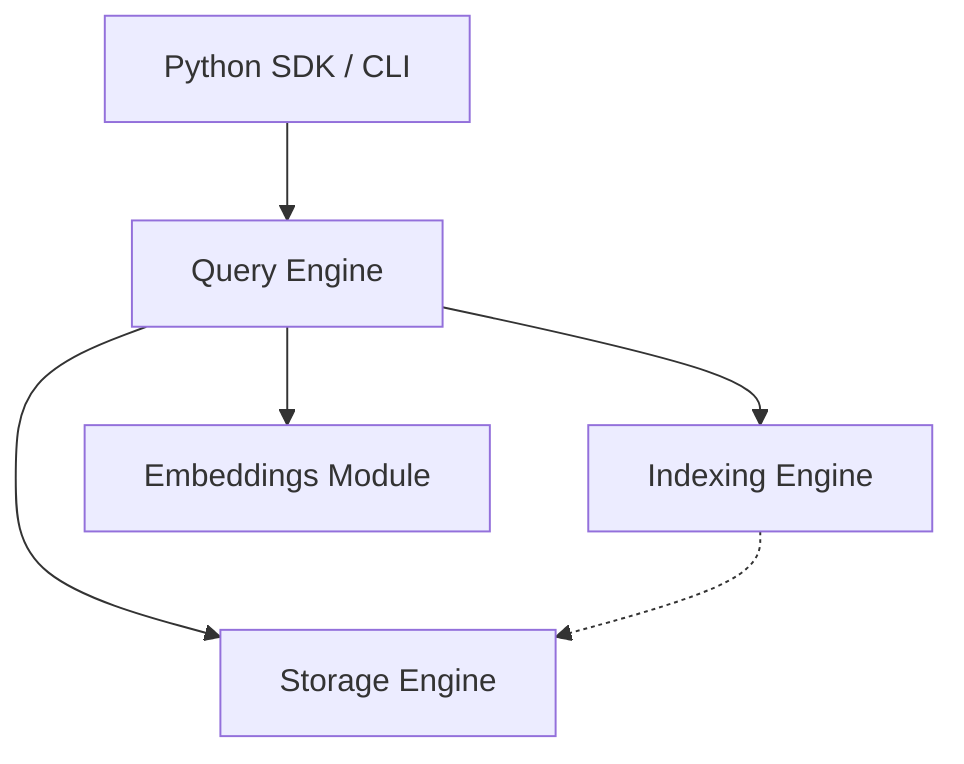

# System Architecture: SimpleV

## 1. Overview
SimpleV is designed with a strict modular and layered architecture[cite: 17]. This separation of concerns ensures that the database remains easy to test, maintain, and extend over time[cite: 17]. By isolating the storage, indexing, and query execution layers, we can iteratively upgrade individual components without disrupting the developer-facing API.

## 2. Architecture Diagram
The following diagram illustrates the relationship and data flow between the core components of the SimpleV system[cite: 17].

## 3. Core Components

### 3.1. Client Interfaces (SDK / CLI)
This is the uppermost layer acting as the user's entry point[cite: 17]. It provides a clean, Pythonic API and a straightforward Command Line Interface, abstracting the internal complexity of vector math, embedding models, and file management[cite: 17].

### 3.2. Query Engine
The Query Engine acts as the central orchestrator[cite: 17]. When a read or write request is received, it manages the execution pipeline: interacting with the embeddings module, validating pre and post filters, coordinating with the indexing engine for vector retrieval, and hydrating results from the storage engine[cite: 17].

### 3.3. Embeddings Module
This module handles the automatic conversion of text into vector representations[cite: 17]. It serves as a lightweight wrapper around libraries like sentence-transformers, downloading and caching models locally to ensure offline functionality[cite: 17].

### 3.4. Indexing Engine
The Indexing Engine is responsible for the vector search algorithms[cite: 17].  
* For version 0.1, it implements a Flat Index using exact nearest neighbor search via standard array operations[cite: 17].
* For version 0.4, it will introduce an Approximate Nearest Neighbor (ANN) approach using Hierarchical Navigable Small World (HNSW) graphs to support larger dataset scaling[cite: 17].

### 3.5. Storage Engine
The Storage Engine handles all disk persistence and memory caching[cite: 17]. It manages the Write-Ahead Log (WAL) and custom `.sv` file operations[cite: 17]. Its primary responsibility is to ensure that vector arrays and document metadata are stored efficiently and safely, guaranteeing data integrity during application lifecycle events.

## 4. Extensibility Strategy
While the initial versions are built primarily in Python, the boundaries between these modules are intentionally strict. This design choice anticipates the future integration of performance-critical indexing and storage modules written in lower-level languages, allowing the architecture to grow gracefully alongside user demands.