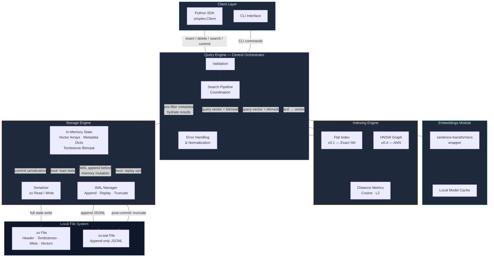
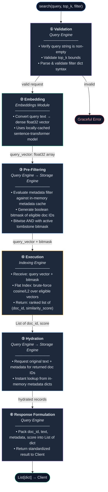
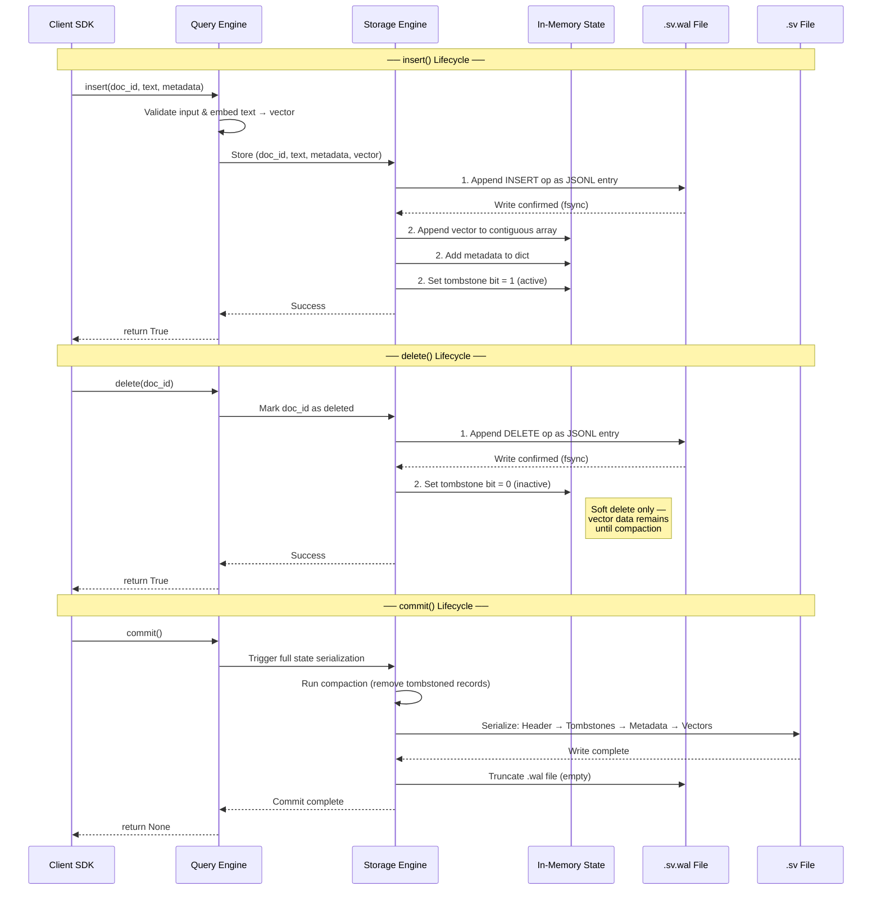
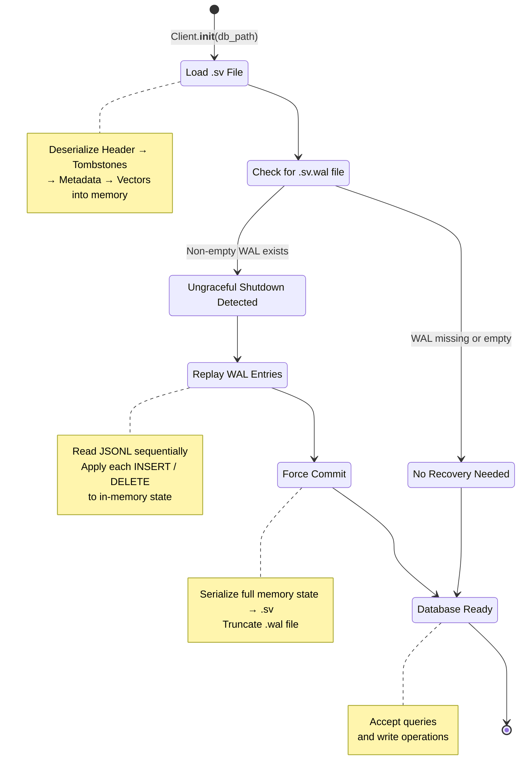
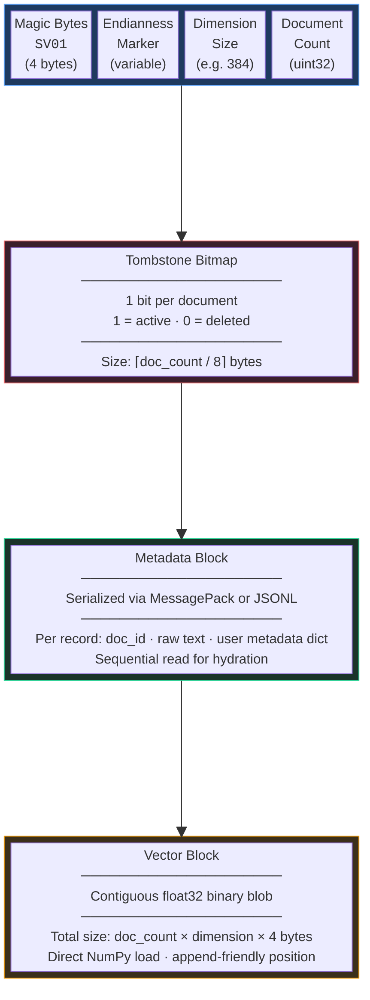

# SimpleV — Architecture Diagrams

> **Source of truth:** All diagrams below are derived exclusively from the specifications defined in
> [`ARCHITECTURE.md`](ARCHITECTURE.md), [`QUERY_ENGINE.md`](QUERY_ENGINE.md),
> [`STORAGE_ENGINE.md`](STORAGE_ENGINE.md), [`INDEXING.md`](INDEXING.md),
> [`FILE_FORMAT.md`](FILE_FORMAT.md), and [`WAL.md`](WAL.md).
> No features have been invented beyond what is documented.

---

## Table of Contents

1. [Detailed System Architecture](#1-detailed-system-architecture)
2. [Query Execution Pipeline](#2-query-execution-pipeline-6-step-search)
3. [Storage & WAL Lifecycle](#3-storage--wal-lifecycle)
4. [Crash Recovery Boot Sequence](#4-crash-recovery-boot-sequence)
5. [`.sv` Binary File Format Layout](#5-sv-binary-file-format-layout)
6. [Data Flow Contracts Summary](#6-data-flow-contracts-summary)

---

## 1. Detailed System Architecture

Expands on the high-level diagram in [`ARCHITECTURE.md`](ARCHITECTURE.md). Shows exact module boundaries, bidirectional data contracts between layers, and the two on-disk persistence artifacts (`.sv` and `.wal`).

**Key design decisions:**
- The **Query Engine** is the sole orchestrator — it is the only component that touches both the Indexing Engine and the Storage Engine.
- The **Indexing Engine** has a read-only, indirect relationship with the Storage Engine (it operates on vectors already loaded into memory by Storage).
- The **Embeddings Module** is a stateless utility; it caches models locally but holds no database state.
- Two distinct file types exist on disk: the canonical `.sv` binary and the append-only `.sv.wal` journal.

---

## 2. Query Execution Pipeline (6-Step Search)

Maps the strict, sequential pipeline defined in [`QUERY_ENGINE.md`](QUERY_ENGINE.md). Each step is annotated with the responsible module and the data type crossing the boundary.

**Key design decisions:**
- Pre-filtering uses **bitwise operations** on the metadata cache to produce a boolean bitmask — this keeps the Indexing Engine free of dictionary-lookup overhead.
- Hydration is a separate read path back into the Storage Engine; the Indexing Engine returns only `(doc_id, score)` tuples.
- The response is a standardized `List[dict]` — the only object the Client ever receives.

---

## 3. Storage & WAL Lifecycle

Sequence diagram covering the full write lifecycle as specified in [`WAL.md` §2](WAL.md) and [`STORAGE_ENGINE.md` §3](STORAGE_ENGINE.md). Covers `insert()`, `delete()`, and `commit()` — the three mutating operations from [`API_SPEC.md`](API_SPEC.md).

**Key design decisions:**
- **Write ordering is strict:** WAL append happens _before_ the in-memory mutation. This is the fundamental durability guarantee.
- `delete()` does not physically remove data — it sets a tombstone bit in the bitmask. Actual removal happens at compaction time during `commit()`.
- `commit()` serializes the _entire_ current memory state to `.sv`, then truncates the WAL. This is a full-state checkpoint, not an incremental patch.

---

## 4. Crash Recovery Boot Sequence

State diagram showing the initialization path defined in [`WAL.md` §3](WAL.md). This is the sequence the Storage Engine follows every time `Client.__init__(db_path)` is called with a file-backed path.

**Key design decisions:**
- The system performs **deterministic replay:** WAL entries are applied sequentially in the exact order they were logged, preserving causal consistency.
- After replay, an **immediate forced commit** occurs — this collapses the WAL into the `.sv` file so the recovery path is never re-executed on the same entries.
- If no WAL exists or the WAL is empty, boot is a simple `.sv` load with no replay overhead.

---

## 5. `.sv` Binary File Format Layout

Visual representation of the sequential byte layout described in [`FILE_FORMAT.md`](FILE_FORMAT.md). The `.sv` file is structured sequentially into four distinct blocks, ensuring minimal read/write overhead.

**Key design decisions:**
- The header is **fixed at 64 bytes** — any tool can read the first 64 bytes to determine file validity, format version, vector dimensions, and record count without parsing the rest.
- The tombstone bitmap is **bit-packed** (1 bit per document), making it extremely compact: 1 million documents require only ~122 KB.
- The vector block is placed **last** by design — this enables append-only vector writes and allows NumPy `memmap` / `frombuffer` zero-copy loading.
- Metadata is serialized via MessagePack or JSON-lines, providing a pragmatic balance between parse speed and human debuggability.

> **Note:** The 64-byte header is fixed-length regardless of database size. All variable-length sections (tombstones, metadata, vectors) scale linearly with document count. The vector block dominates file size: a 100K-document database at 384 dimensions occupies ~147 MB for vectors alone (`100,000 × 384 × 4 bytes`).

---

## 6. Data Flow Contracts Summary

| Boundary | Data Crossing | Format |
|---|---|---|
| Client → Query Engine | `insert(doc_id, text, metadata)` / `search(query, top_k, filter)` / `delete(doc_id)` / `commit()` | Python method calls |
| Query Engine → Embeddings | Raw text string | `str → float32[]` |
| Query Engine → Indexing Engine | Query vector + boolean bitmask | `(ndarray, ndarray)` |
| Indexing Engine → Query Engine | Ranked results | `List[(doc_id, score)]` |
| Query Engine ↔ Storage Engine | Pre-filter metadata lookup / Hydration request | `dict` / `List[doc_id]` |
| Storage Engine → WAL | Operation record | JSONL append |
| Storage Engine → `.sv` File | Full serialized state | Custom binary (Header · Tombstones · Meta · Vectors) |
