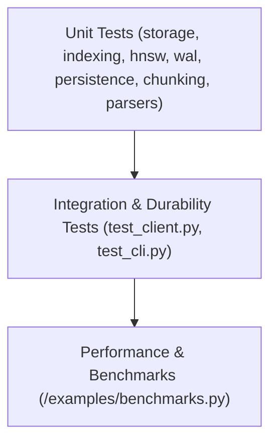

# Testing Strategy: SimpleV

## 1. Overview
SimpleV is built on database principles where correctness, durability, and computational reproducibility are paramount. Our testing strategy ensures that every layer—from disk serialization and write-ahead logging to vector math and client interfaces—is thoroughly verified under both normal operation and simulated failure conditions.

## 2. Test Pyramid & Design Principles

### 2.1. Isolated, Fast Execution via Mocking
- **Embeddings Mocking:** Loading dense transformer models (`sentence-transformers`) incurs multi-second overhead and external network downloads. In the unit test suite (`tests/test_client.py`, `tests/test_query.py`, `tests/test_cli.py`), the `EmbeddingManager` is mocked to emit deterministic float32 vectors.
- **Fast Feedback Loop:** By eliminating model loading overhead from unit tests, the entire core test suite executes in under 2 seconds.

### 2.2. Deterministic Vector Arithmetic
- Vector similarity operations (`FlatIndex`, `HNSWIndex`) are verified with fixed, orthogonal, and known-angle vectors (e.g. $[1, 0, 0]$, $[0, 1, 0]$, $[1, 1, 0]$) to confirm exact cosine similarities ($1.0$, $0.7071$, $0.0$) and Euclidean distances.
- Edge cases including zero-norm vectors, empty vector sets, dimension mismatches, and 2D query tensors are strictly tested for graceful handling.

## 3. Module Test Coverage

| Test Module | Target Component | Key Verification Targets |
|---|---|---|
| `test_storage.py` | `StorageEngine` | Contiguous array allocation, float32 conversion, soft deletion tombstone bitmasks, metadata lookups, memory compaction. |
| `test_indexing.py` | `FlatIndex` | Exact nearest-neighbor search, Cosine vs. L2 ordering, mask exclusion, dimension mismatches. |
| `test_hnsw.py` | `HNSWIndex` | Multi-layer graph construction, greedy routing, candidate beam search, pre-filter masking, top-K recall vs. exact search. |
| `test_persistence.py` | `FileManager` | 64-byte binary header validation, bitpacked tombstone bitmap packing/unpacking, metadata JSON serialization, round-trip fidelity. |
| `test_wal.py` | `WriteAheadLog` | Append-only JSONL format, atomic flush/fsync, truncation, corruption resilience, vector precision. |
| `test_chunking.py` | `chunking` | Character and separator chunking, boundary overlap preservation, metadata propagation. |
| `test_parsers.py` | `parsers` | Text, Markdown, CSV, PDF, and DOCX document extraction with fallback encoding and missing-dependency skipping. |
| `test_cli.py` | `simplev.cli` | Terminal commands (`init`, `ingest`, `search`, `info`), JSON output, exit codes. |
| `test_client.py` | `simplev.Client` | End-to-end SDK workflow, crash recovery boot sequence, uncommitted write replay, persistence checkpointing. |

## 4. Durability & Crash Recovery Testing
A critical requirement of SimpleV is ensuring zero data loss across ungraceful process terminations. 

Crash recovery testing (`test_crash_recovery_replays_inserts`, `test_crash_recovery_replays_deletes` in `test_client.py`):
1. Initializes a file-backed client with `use_wal=True`.
2. Adds and commits baseline records to `.sv`.
3. Performs mutations (inserts, deletes) logged exclusively to the `.wal` journal.
4. Simulates an abrupt crash by closing the file handle and deleting the client object without calling `commit()`.
5. Re-initializes a new `Client` on the same file path.
6. Asserts that the boot sequence replayed all missing mutations and safely compacted the state.

## 5. Benchmarks & Performance Verification
Performance targets defined in `Info/BENCHMARKS.md` are verified using `examples/benchmarks.py`:
- **Ingestion Speed:** Target $> 500$ documents/sec.
- **Query Latency (Flat):** Target $< 10$ ms for top-10 on 10,000 vectors.
- **Storage Footprint:** Target $< 20$ MB for 10,000 vectors + metadata.
- **HNSW Recall:** Target $> 80\%$ top-10 recall vs. brute-force search.