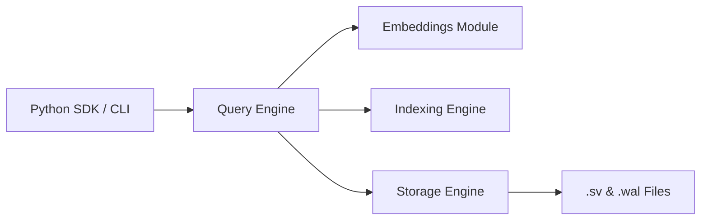

# SimpleV

> **The "SQLite for Vector Search"** — A local-first, zero-configuration vector database designed for AI applications, Retrieval-Augmented Generation (RAG), semantic search, and personal knowledge bases.

---

## Architecture

SimpleV is built with a strict **modular, layered architecture** — isolating storage, indexing, query execution, and embeddings into independent, testable components.

 **[View All Architecture Diagrams →](ARCHITECTURE_DIAGRAMS.md)** — Detailed Mermaid diagrams covering:

| # | Diagram | What It Shows |
|---|---------|---------------|
| 1 | [System Architecture](ARCHITECTURE_DIAGRAMS.md#1-detailed-system-architecture) | Full module boundaries, data contracts, and disk artifacts |
| 2 | [Query Pipeline](ARCHITECTURE_DIAGRAMS.md#2-query-execution-pipeline-6-step-search) | The 6-step search execution flow |
| 3 | [Storage & WAL Lifecycle](ARCHITECTURE_DIAGRAMS.md#3-storage--wal-lifecycle) | Write ordering, soft deletion, and commit serialization |
| 4 | [Crash Recovery](ARCHITECTURE_DIAGRAMS.md#4-crash-recovery-boot-sequence) | Boot sequence with WAL replay |
| 5 | [`.sv` File Format](ARCHITECTURE_DIAGRAMS.md#5-sv-binary-file-format-layout) | Custom binary layout (Header → Tombstones → Metadata → Vectors) |

---

## Overview

As AI and Large Language Models (LLMs) become mainstream, the tooling around them has grown increasingly complex. Many vector databases require dedicated servers, Docker containers, cloud accounts, and intricate embedding configurations. 

**SimpleV** is built to solve the "infrastructure fatigue" in the AI ecosystem. Our mission is to provide an extremely simple, developer-friendly vector database that works locally with a single Python import. We prioritize an exceptional developer experience without sacrificing powerful internals, making it the perfect tool for local AI development, experimentation, and edge deployments.

## Problem Statement & Philosophy

**The Problem:** Students, researchers, and developers often want a lightweight solution to store and search vectors locally, but are forced to navigate enterprise-scale distributed databases.

**The SimpleV Philosophy:**
*   **Local-First:** All data lives on your machine. No cloud dependencies, no network latency, complete data privacy.
*   **Zero Configuration:** Sensible defaults right out of the box. No manual embedding configuration required unless you want it.
*   **Python-First Developer Experience:** Intuitive, Pythonic API designed to get out of your way.
*   **Educational Architecture:** Codebase designed to be readable and extensible, demonstrating database internals.
*   **Powerful Internals:** Simple on the outside, robust on the inside (HNSW, WAL, persistence).

## Target Audience

SimpleV is purpose-built for:
*   **AI & ML Engineers** prototyping RAG systems.
*   **Developers** integrating semantic search into local applications.
*   **Students & Researchers** exploring vector search algorithms.
*   **Local LLM Users** managing personal knowledge bases.
*   **Open-Source Contributors** looking to build core database infrastructure.

---

## Quickstart

Get up and running in seconds. No Docker. No cloud setup.

### Installation
pip install simplev
import simplev

# Initialize the database (creates 'my_knowledge_base.sv' locally)
db = simplev.Client("my_knowledge_base.sv")

# Insert documents (SimpleV handles the embeddings automatically!)
db.insert(doc_id="doc_1", text="SimpleV is an open-source, local-first vector database.")
db.insert(doc_id="doc_2", text="The capital of France is Paris.")
db.insert(doc_id="doc_3", text="Retrieval-Augmented Generation improves LLM accuracy.")

# Perform a semantic search
results = db.search("Tell me about local vector databases", top_k=1)

print(results)
# Output: [{'doc_id': 'doc_1', 'text': 'SimpleV is an open-source, local-first vector database.', 'score': 0.89}]

## Core Stack

Language: Python (MVP) -> Rust/PyO3 (Future Performance Modules)
Math/Vector Ops: NumPy
Embeddings: Sentence Transformers (defaulting to lightweight, high-performance models)

# Project for IEEE GEHU SoC'26